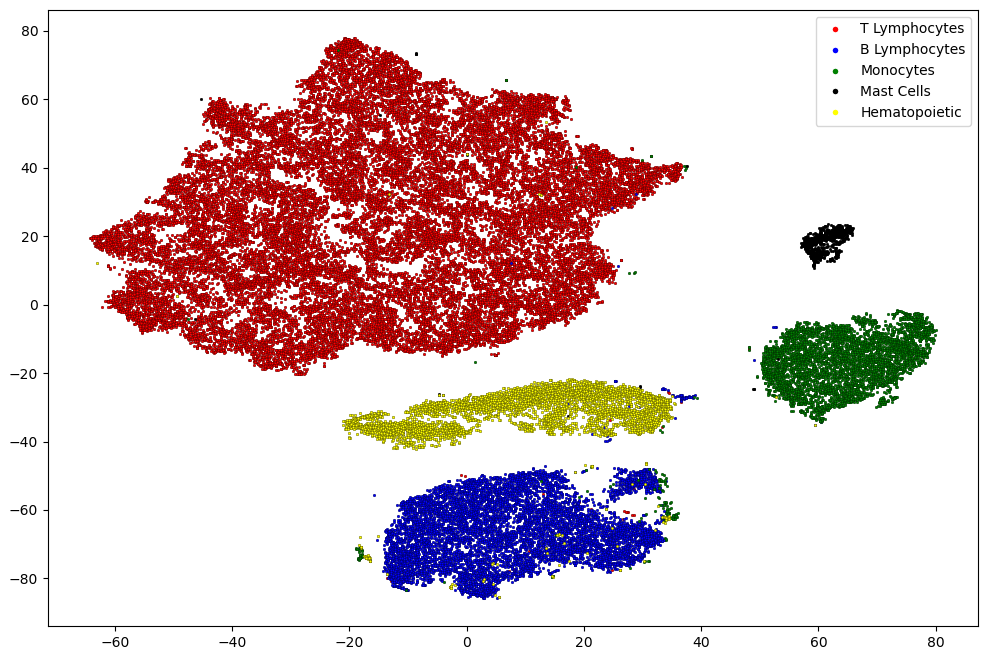

# Transductive Learning Experiments

This directory contains code for running transductive learning experiments on the FlowCyt dataset. 

Transductive learning utilizes labeled and unlabeled examples during training to make predictions on the unlabeled data. This can be useful when labels are limited or expensive to obtain. In this way, we further proved the effectiveness of the models by using the transductive learning methodology outlined in [yang2016](https://arxiv.org/abs/1603.08861). During the training phase, the models were given access to the feature vectors of all nodes. Our primary goal was to classify the status of cells, distinguishing between the five different classes, while also evaluating the reliability of the classification performances in a semi-supervised setup utilizing up to one million cells per patient.

To achieve this, we randomly assigned 10\% of the nodes for validation and 10\% for testing while keeping the classes' ratio balanced, the same as in the full dataset. Since our model is strongly imbalanced, we used a weighted negative log-likelihood loss function. Then we randomly masked the labels of 50\% of the training, validation, and test set. Therefore, We can think of our problem as having a large graph where half of the graph is unlabeled, and our goal is to predict the labels based on the ones we have.

To highlight the strength of graph models, the figure below shows the [t-SNE](https://www.jmlr.org/papers/volume9/vandermaaten08a/vandermaaten08a.pdf?fbcl) embedding visualization of GAT for one random patient (patient 23 has been randomly picked). Despite the difficulties due to the mask setup typical of transductive learning, we can see how the graph model has clustered the five classes into its final embedding layer.  

## Usage

```python
python -u -m trans.gnn_trans --model GAT --num_layers 1 --hidden_features 64 --dropout 0.2 --in_heads 2 --out_heads 2 --input_dim 12 --output_dim 6 --max_num_epochs 1000 --start_lr 0.01
python -u -m trans.gnn_trans --model GCN --num_layers 1 --hidden_features 64 --dropout 0.3 --input_dim 12 --output_dim 6 --max_num_epochs 1000 --start_lr 0.01
python -u -m trans.gnn_trans --model SAGE --num_layers 1 --hidden_features 64 --dropout 0.3 --input_dim 12 --output_dim 6 --max_num_epochs 1000 --start_lr 0.01
```

By configuration's experiment, `input_dim` is always set to 12, and `ouput_dim` is set to 5, since the transductive framework in the paper has been mainly applied to the sub-population files. However, if researchers are interested can modify set `output_dim` as 6 in the above one, to run experiments on the total populations (they also would need to modify `INPUT_GRAPH` inside the `gnn_trans.py`).

## Citation 

Please cite the FlowCyt paper if you find this useful:

```
@inproceedings{flowcyt2024,
  title={FlowCyt: A Comparative Study of Deep Learning Approaches for Multi-Class Classification in Flow Cytometry},
  author={Bini, Lorenzo and Mojarrad, Fatemeh Nassajian and Liarou, Margarita and Matthes, Thomas and Marchand-Maillet, Stéphane},
  booktitle={Conference on Health, Inference, and Learning (CHIL)},
  year={2024}
}
```
